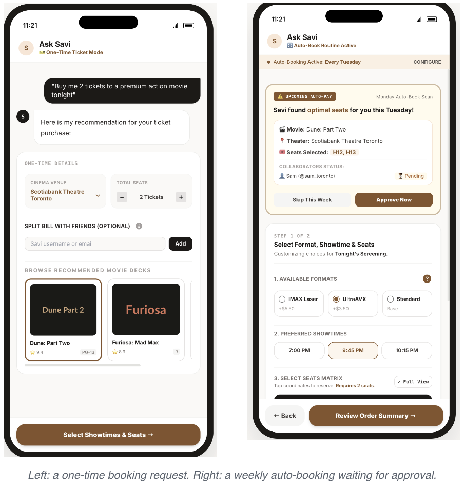
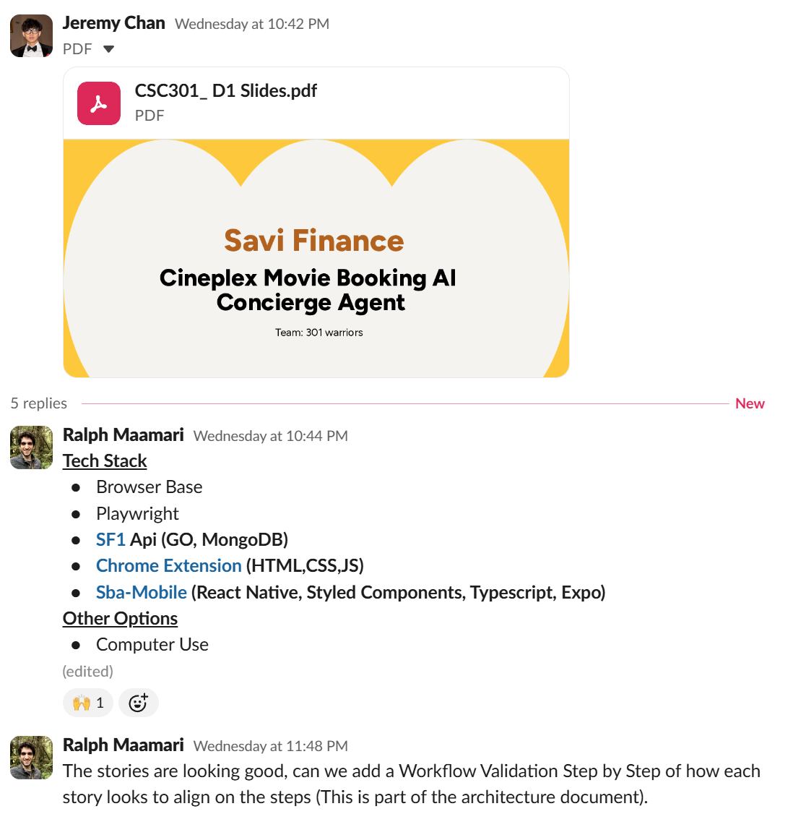
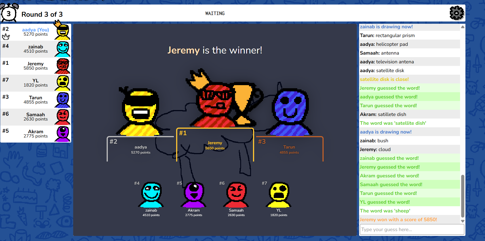
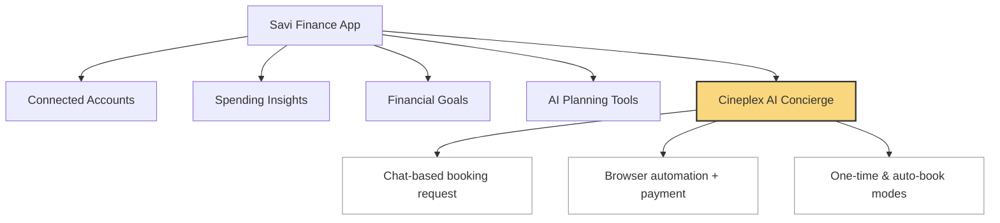

# 301 Warriors

## Product Details
 
#### Q1: What is the product?

We are creating an extension to a pre-existing chatbot app (on iOS and Android) where you can ask Savi, an AI assistant, to find and book movie tickets at any Cineplex theatre for you, either once or automatically every week.

Now, what is the problem that we’re trying to solve? Booking a movie ticket is not hard, but it is repetitive. Think about someone who goes to the movies with a friend every Tuesday. Every week, they open the Cineplex app or website, pick the same theatre, scroll through the movies, choose a format and showtime, find two seats together, pick a payment method, and check out. It only takes a few minutes, but it is the same few minutes every single week, and most of the choices never change.

We think this process should take zero thought. You should be able to say what you want once, and have it handled for you.

We are working with Savi Finance and helping develop/create this AI agentic system for them, the project is the Cineplex Movie Booking AI Concierge Agent.

What does the product do, and moreso, how does it work? Savi AI lets users book movies by simply asking for them in a chat. Behind the scenes, Savi goes through the Cineplex booking process on the user's own account: it picks the theatre, the movie, the seats, and the payment method, pays for the tickets, and lets the user know when the booking is done. Users can follow along in the app while Savi works, and can step in to change anything they want.

The app has two main modes:
1. One-Time Ticket Mode: The user asks for something like "Buy me 2 tickets to a premium action movie tonight." Savi recommends a theatre and a few movies, and the user can adjust the number of seats or split the bill with friends before picking a showtime and seats.
2. Auto-Book Routine: The user sets up a weekly routine (for example, every Tuesday). Each week, Savi finds the best seats for them and asks for a quick approval before paying. The user can approve it, skip the week, or change the format, showtime, or seats.

Below, I’ll list some common use cases of our project:
- A couple who sees a movie every Tuesday night and wants the same theatre, format, and seats booked automatically each week.
- A group of friends who want to go to a movie tonight, and want to split the cost without one person paying and chasing everyone for money.
- Someone who just knows the kind of movie they want to see (for example, "something action in IMAX") and does not want to browse showtimes themselves.

Finally, why does this really matter? Beyond saving time for movie-goers, this project is a small look at where apps may be heading: instead of navigating menus and forms, users just say what they want, and an AI agent takes care of the rest.

#### Q2: Who are your target users?

Our target users are Cineplex customers who want a more convenient, personalized way to book movie tickets without manually navigating the traditional booking process.

**Persona 1: The Routine Moviegoer**

A customer who watches movies regularly and has established preferences for theatres, showtimes, seating, and payment methods. They want Savi AI to remember these preferences and automate recurring movie bookings, making it easier to maintain their moviegoing routine.

**Persona 2: The Convenience-Focused Customer**

A customer who enjoys watching movies but has limited time to browse theatres, compare showtimes, select seats, and complete checkout. They want to make a simple request through the mobile app, such as booking two tickets for a particular movie at a nearby theatre, and have the AI concierge handle the booking process.

While routine moviegoers benefit from personalized, recurring automation, occasional moviegoers benefit from a simpler, faster way to book individual outings.

#### Q3: Why would your users choose your product? What are they using today to solve their problem/need?

Today, Cineplex customers typically use the Cineplex website or mobile app to manually select a theatre, movie, showtime, number of tickers, seats, and payment method. While this works for individual bookings, the process can become repetitive for customers who watch movies regularly or already know their preferences.

**Savi AI** provides an alternative through an AI-powered concierge that allows users to describe what they want in a simple request. Instead of navigating each step themselves, users can ask Savi to book a movie based on their preferences, while the system handles theatre selection, showtime selection, seat selection, and checkout.

The main benefits are **convenience, personalization, and automation**. Savi can remember preferences such as preferred theatres, seating, and payment methods, reducing repeated inputs and the number of manual steps required for future bookings. For routine moviegoers, recurring bookings can further reduce the effort required to plan regular movie outings. For individual bookings, users can make a request without manually navigating through multiple booking screens.

While Cineplex already provides a digital booking experience, Savi differs by introducing a **conversational AI interface and autonomous booking process**. Rather than requiring users to operate the interface themselves, Savi is designed to carry out the booking on their behalf and allow users to view the booking and follow the agent's progress through the mobile application.

This approach supports our partner's goal of exploring how **AI agents can move beyond traditional interfaces and automate everyday tasks**, while providing Cineplex customers with a more seamless way to book and manage their movie experiences.

#### Q4: What are the user stories that make up the Minumum Viable Product (MVP)?

Our MVP is made up of 8 user stories that cover the complete movie booking flow. Stories 1-5 form the core booking experience while stories 6-8 extend the product into the more personalised "concierge" experience through memory, recurring bookings, group coordination, and savings discovery.

**User Story Artifact**: [View our User Story Cards](https://www.figma.com/board/gCGdJYfJFVIfN4WBiQkCZy/User-Story-Card?node-id=0-1&t=ymdOFpdpOoLjHjbK-1)

### User Story 1 — Request a Personalized Movie Booking

**As a Savi user, I want to request movie tickets conversationally and have Savi remember my usual preferences in order to begin a personalized booking without repeatedly entering the same information.**

**Acceptance Criteria:**
- User can make a natural-language movie request.
- Request may include ticket count, genre, time, theatre, or format.
- Savi uses relevant saved preferences to fill missing details.
- User can review and override remembered preferences.
- Savi returns at least one suitable booking option.
- If key information is missing, Savi asks the user to clarify.

### User Story 2 — Review & Modify Booking Preferences

**As a Savi user, I want Savi to pre-fill my booking using my saved preferences while still allowing me to review and modify the booking in order to ensure it matches what I want for this outing.**

**Acceptance Criteria:**
- User can review Savi's selected movie and booking details.
- Savi may pre-fill details using saved preferences.
- User can modify theatre, ticket count, format, and showtime.
- User can override any preference selected from memory.
- All changes are reflected before continuing.
- Required booking information must be complete before proceeding.

### User Story 3 — Select Seats

**As a Savi user, I want to select seats or receive seat suggestions based on my preferences in order to get seating that suits me.**

**Acceptance Criteria:**
- User can view available and unavailable seats for the selected showtime.
- User can select the required number of seats.
- Savi can suggest seats based on the user's seating preferences.
- User can override Savi's suggestions and choose different seats.
- The application prevents proceeding when the seat count does not match the ticket count.

### User Story 4 — Review & Confirm Booking

**As a Savi user, I want to review my complete booking before payment in order to confirm that the movie, theatre, time, seats, and price are correct.**

**Acceptance Criteria:**
- Booking summary shows the movie, theatre, date, showtime, format, seats, ticket quantity, and total price.
- User can return to edit booking details before payment.
- User must explicitly confirm before checkout begins.
- If checkout fails, the user receives a clear error.
- A failed checkout must not be displayed as a successful booking.

### User Story 5 — Complete Booking & Receive Tickets

**As a Savi user, I want Savi to complete the Cineplex booking and show me my confirmation and tickets in order to attend the movie without having to finish the transaction manually on Cineplex.**

**Acceptance Criteria:**
- After confirmation, Savi initiates the booking through the backend.
- A successful booking produces a clear confirmation state.
- Confirmation includes the movie, theatre, showtime, format, and seats.
- User can view their digital tickets after a successful purchase.
- A failed booking must never display a valid-looking ticket.

### User Story 6 — Saved Preferences & Weekly Auto-Booking

**As a returning Savi user, I want Savi to remember my movie-going preferences and use them when preparing recurring movie bookings in order to reduce the effort required each time I want to go to the movies.**

**Acceptance Criteria:**
- Savi stores and retrieves recurring movie-booking preferences.
- Saved preferences may include ticket count, theatre, genre, format, seating, and schedule.
- Savi uses these preferences to generate a booking proposal.
- Proposal shows the movie, theatre, showtime, seats, and price.
- User can modify, approve, or skip the proposal.
- Skipped bookings do not proceed; approved bookings enter the normal checkout flow.

### User Story 7 — Coordinate a Group Booking

**As a Savi user, I want Savi to coordinate a movie booking with my friends in order to manage invitations, confirmations, booking decisions, and payment coordination without organizing everyone manually.**

**Acceptance Criteria:**
- User can invite friends by Savi username or email.
- Savi tracks each participant's confirmation status.
- Organizer can see who has confirmed or is still pending.
- Organizer can wait, proceed alone, or purchase all tickets.
- Savi can send split-payment requests when the organizer pays.
- Once coordination is resolved, the booking continues to checkout.

### User Story 8 — Discover & Apply Coupons, Vouchers & Credits

**As a Savi user, I want Savi to identify eligible coupons, vouchers, and credits from both my connected email accounts and available Savi offers in order to easily discover and apply savings before completing my movie purchase.**

**Acceptance Criteria:**
- Savi identifies eligible savings from connected email accounts and Savi offers.
- Email scanning only occurs for accounts authorized by the user.
- Available savings are shown during review or checkout.
- Each discount shows its source and value.
- User chooses which eligible discount to apply.
- Applied savings update the price before final payment.

### Partner Review
These user stories were reviewed and approved by our partner, Ralph Maamari, Co-founder and CEO of Savi Finance

**Evidence of partner review**: 

#### Q5: Have you decided on how you will build it? Share what you know now or tell us the options you are considering.

Our partner has specified the preferred technology stack for this project:

- **Backend:** Go 
- **Frontend:** React Native with TypeScript and styled-components, for a shared iOS/Android codebase
- **Development tooling:** Claude, Codex, and Cursor as AI-assisted coding tools throughout the project

Since we are continuing an existing, partly-built prototype rather than starting from scratch, our architecture decisions build on what the partner has already set up. The remaining components we are responsible for are:

- **Web browser traversal & payment:** Automating the Cineplex booking flow (theatre, movie, showtime, seat, and payment selection) on the user's behalf. Since our backend is in Go, we are considering browser automation libraries that integrate natively with Go (e.g., driving headless Chrome via the Chrome DevTools Protocol) rather than introducing a separate automation service in another language.
- **Mobile RAG integration:** Retrieving a user's stored preferences (preferred theatre, seat type, price range, genre, booking frequency) so the AI agent can make contextually appropriate decisions without the user re-specifying them each time.
- **UI/Front-end:** Building the chat-based request flow, a live view of the agent's booking progress, and a confirmation step before any payment is made.
- **Stretch goal:** Exploring the HTTP 402 "Payment Required" status code in the context of agent-conducted payments, to better understand emerging standards for AI agents handling payment flows autonomously.

We have not yet finalized our exact deployment process or third-party dependencies beyond what the partner will provide, and will confirm these details with our partner as we get further into development.

----
## Intellectual Property Confidentiality Agreement 

Our partner has agreed that we may share the work our team creates for this project, including our code and software. We will not share code created by the partner or other contributors unless they give us permission.

----

## Teamwork Details

#### Q6: Have you met with your team?

Yes, we have met each other!

For our team-building activity, we decided to meet up online and play a competitive drawing game called Skribbl.io. We played two rounds, where each person took turns drawing different words while the rest of us tried to guess the word. It was a very fun way to get to know each other outside of our project responsibilities, learn more about one another, and bring out our competitive spirits. 

Here is the leaderboard at the end of our game. Although everyone tried their best to win, Jeremy came out on top and stood first place!

**Fun-facts!**

* Akram is a big Mario fan and enjoys the Super Mario games and characters.
* Tarun grew up watching Pokémon, making it one of the shows he remembers fondly from his childhood.
* Zainab is a coffee lover and enjoys having coffee as part of her daily routine.
* Aadya loves watching sitcoms and her favorite one is Modern Family 

#### Q7: What are the roles & responsibilities on the team?

The roles required for this project include:

- **AI Agent** engineer: responsible for the agent's reasoning, conversation, tool use, and decision-making 

- **Backend** developer: responsible for the APIs, databases, authentication, booking logic, and integrations 

- **Frontend** developer: responsible for the chat interface, movie/showtime UI, seat selection, and booking experience

- **AI QA & Testing** engineer: responsible for the testing whether the agent behaves correctly, safely, and reliably

- **DevOps** engineer: responsible for the deployment, infrastructure, monitoring, and security  
          
- **Product/UX** engineer: responsible for user flows, requirements, interaction design, and making the booking experience intuitive 

- **Payment/Security**: responsible for payments, authorization, security, and fraud prevention

Based on these descriptions, this is how we chose to assign each of our roles, given either our knowldge, exprience, and interest in the role:

**Akram**: *Backend, AI Testing, and DevOps*
- **Reason**: Has experience working on apps with Express, Node.js, and MongoDB. Has a solid understanding of AI and software development methodologies such as Agile. 

**Zainab**: *Frontend, Backend*
- **Reason**: Has experience with full-stack development through previous projects.
- Team Lead and Main Coordinator

**Samaah**: *AI agent, AI Testing, and Backend*
- **Reason**: Worked with AI APIs, RAG, and AI-driven features in projects, and built backend systems using Node.js, Express, REST APIs, and databases.

**Jeremy**: *Backend and AI Testing*
- **Reason**: Has experience experience working with APIs, backend systems, and application integration.

**Tarun**: *Payments, Product, and Backend*
- **Reason**: Built a sports betting app, primarily working on backend, UX, and processing payments. Very interested in the Payments/Security role. 

**Yuan**: *AI agent and AI Testing*
- **Reason**: Learned the basics and done personal projects with AI agents.

**Aadya**: *Frontend and Backend*
- Reason: Worked with backend in previous projects/coops and currently taking a Web Development course.

#### Q8: How will you work as a team?

Our team attends the online tutorial on Tuesdays to answer the TA’s questions and discuss our progress. We also meet online on Tuesdays from 6:30–7:00 p.m. for the team-building activity. After tutorial, we discuss the following week’s work, assign tasks, and identify any blockers.

We meet with our project partner online every Wednesday from 10:40–11:00 p.m. to review user stories, get feedback, and agree on next steps. We will have two partner meetings before D1 is due; if needed, we will schedule an additional online meeting before the deadline. For the rest of the term, we will continue the weekly Wednesday schedule and arrange coding sessions or code reviews as needed. We will record minutes for each partner meeting in deliverables/minutes.

#### Q9: How will you organize your team?

List/describe the artifacts you will produce to organize your team. (We strongly recommend that you use standard collaboration tools like Linear.app, Jira, Slack, Discord, GitHub.)       

 * Artifacts can be To-Do lists, Task boards, schedule(s), meeting minutes, etc.
 * We want to understand:
   * How do you keep track of what needs to get done? (You must grant your TA and partner access to systems you use to manage work)
   * **How do you prioritize tasks?**
   * How do tasks get assigned to team members?
   * How do you determine the status of work from inception to completion?

We will use Monday as our central project management system, supported by GitHub, Discord, Slack, and Google Meet. We aim to maintain a single source of truth for project work while organising team and partner communication separately. 

**Monday** - Task board and sprint planning

All project work will be represented as tasks on our Monday board. Tasks will have an owner, status, taskID, estimated story points, type, epic, and relevant GitHub link. Work that has not yet been scheduled will remain in the Backlog, while work that has been selected for development will be moved into the active sprint. Larger features will be organised under epics so that individual tasks can be traced back to project goals and user stories. Our TA and partner will be given access so they can view our progress directly.

**Prioritization**: At the beginning of each sprint, we will review the backlog as a team and prioritize work based on MVP importance, dependencies, partner requirements, technical risks, and estimated effort. 
Task assignment: Each task will have one clear owner responsible for coordinating it, even if multiple members collaborate on the implementation. Tasks will be assigned during sprint planning and we will avoid concentrating entire components with one person.

**Task lifecycle**: Each task will progress through the states: Backlog → Ready to start → In progress → Review/Testing → Done. A task is only considered complete when relevant testing is finished and the associated code has been reviewed and merged into GitHub. Blocked tasks will be marked and discussed during team meetings so dependencies can be resolved quickly.

**Note taker**: With meeting participants’ consent, we plan on using Monday’s AI note taker functionality to record and transcribe meetings. The generated notes and action items will be reviewed by the team before adding to GitHub meeting minutes and Monday.

**GitHub** - Source code, pull requests, technical artifacts

GitHub will be the source of truth for our code. Monday tasks that involve code will have a relevant GitHub link. Pull requests will allow team members to review changes before merging. The repo will also contain required project artifacts such as planning documents, meeting minutes, team information, readme, and deliverables.

**Google Meet** - Meetings

Google Meet will be used for internal team meetings and partner meetings.

**Discord** - Internal team communication

Discord will be our team’s informal communication channel. We will use it for quick questions, coordination, discussions, between meetings. 

**Slack** - Partner Communications

Slack will be our primary communication channel with our partner. We will use it for questions, discussions, scheduling, and it's where our partner will share technical and educational resources with us. 

#### Q10: What are the rules regarding how your team works?

**Communications:**

Our team meets approximately 1–2 times per week, usually through Google Meet, to discuss our progress, upcoming tasks, blockers, and next steps. We use Discord as our primary method of internal communication for updates, questions, reminders, and coordination between meetings.
For communication with our partner, we use Slack, where we have a shared group chat. The team representative is primarily responsible for broader communication with the partner, such as scheduling meetings, confirming decisions, and discussing project-wide questions. However, individual team members may contact the partner directly when they have specific technical or task-related questions.
 
**Collaboration:**

All team members are expected to attend scheduled tutorial meetings. For internal team meetings and partner meetings, members should avoid missing more than one meeting consecutively unless there is a valid reason. We believe regular communication and frequent check-ins are important for keeping everyone aligned and ensuring that issues are identified early.

Team members are also expected to complete their assigned tasks by the agreed deadlines and communicate early if they are unable to do so. If a team member becomes unresponsive or repeatedly fails to complete assigned work, the team representative will first contact them through Discord, our primary communication channel. If there is still no response, we will attempt to reach them by email.
If the issue continues, it will be documented in the individual feedback required by the course, and the team will clearly record any incomplete or unfulfilled responsibilities in the relevant deliverable documentation.

## Organisation Details

#### Q11. How does your team fit within the overall team organisation of the partner?
Given the current team structure of our partner, our team will contribute mainly towards the Product Development of the Cineplex AI Concierge service. Our main task would be to build on the existing codebase and complete the end-to-end implementation of the Booking and AI Payment System that is to be offer through this service.
	
We are fit for this role due to our prior technical experience and eagerness to learn. Team members have previously worked with full-stack projects, AI integrations through LLM APIs, RAG, prompt engineering, NLP, and machine learning and developed applications with tools like TypeScript, React/Next.js, Python, REST APIs, PostgreSQL, and Docker. We have also taken courses like CSC311 and CSC309 which have further strengthened our technical capabilities. This gives us a strong foundation for working across the different components of the Cineplex AI Concierge 

We are also eager to put in our time to learn new concepts and frameworks required for this project such as browser automation, secure agentic payment, Go, React Native and apply our existing experience to working with the partner's codebase. By combining our existing knowledge and new technologies, we believe we would be able to help deliver a seamless, reliable, and production-ready booking experience.

#### Q12. How does your project fit within the overall product from the partner?

Savi Finance's core product is a personal finance app that brings together connected accounts, spending insights, financial goals, and AI-powered planning tools in one place. The Cineplex AI Concierge is a new feature being added on top of that existing product — it is not a standalone app, and it is not the foundation the rest of Savi Finance is built on.

*(the highlighted branch is our team's scope)*

Our project is not the first prototype of this feature — Savi Finance already has an existing, partly-built implementation (described as roughly half complete and tested), covering the earlier modules of the booking flow. Our team is taking full ownership of completing the remaining core pieces: the web browser traversal payment section, mobile RAG integration for preference-based booking, and the UI/front-end, with a stretch goal of exploring agent-conducted payments (HTTP 402 flow).

Our partner has confirmed that no other team is working on this feature in parallel — our team is the sole group responsible for completing the Cineplex AI Concierge this term.

Unlike a typical course prototype, our partner intends to launch this feature directly to production after this term. They already have a group of users confirmed to use it weekly, so success for them is not just a working demo: it's a feature that is production-ready and reliable enough to launch, with the goal of expanding into similar AI-agent-driven experiences if it proves successful, or otherwise remaining live and supported for its existing user base.

## Potential Risks

#### Q13. What are some potential risks to your project?

1. ***The Cineplex website could change or block automated booking.***
   Savi books tickets by going through the Cineplex website the same way a person would. That means our product depends on a website we don't control. If Cineplex changes its layout, adds a CAPTCHA, or starts detecting and blocking automated visits, the booking flow could break without warning. We also need to confirm with our partner that booking this way is allowed under Cineplex's terms of use, since that affects whether the product can safely launch.

2. ***We are building on code we did not write.***
   The project continues an existing prototype that is described as about halfway done and well tested. That is a big head start, but it also means we need time to understand someone else's code and decisions before we can build on them. If the existing code is harder to work with than expected, or has gaps we don't know about yet, it could slow down the parts we are responsible for.

3. ***Letting an AI agent pay is risky.***
   Most bugs in an app are annoying. A bug here could charge someone for the wrong movie, the wrong number of seats, or book twice. Payment is also the part of the project that is newest to us (including the HTTP 402 "Payment Required" flow), and checkouts often include extra verification steps like a bank confirmation screen that an agent may not be able to get through on its own. On top of that, Savi works on the user's own Cineplex account, so it needs access to their login and saved payment methods.

4. ***The right theatre, movie, and seats are not clearly defined.***
   The expected features say the system should pick the right theatre, movie, seats, and payment method. But what counts as "right" is open to interpretation. If a user asks for "a premium action movie tonight," does that mean IMAX or UltraAVX? What if their usual seats are taken, or the showtime is sold out? If we don't pin these down with our partner, our user stories may end up too vague to build or test, and the result may not match what our partner had in mind.

#### Q14. What are some potential mitigation strategies for the risks you identified?

1. ***The Cineplex website could change or block automated booking.***

   **Solution**: To prevent the AI from being too dependent on the website itself, we will build an abstraction layer that defines the basic functionality the AI needs to do bookings, without relying on how the website itself works. By removing this dependency, we allow easier debugging and cleaner code between the AI Agent and Cineplex API.

2. ***We are building on code we did not write.***

   **Solution**: This requires us to understand and properly test the functionality of the existing code. Sinc most of thes functions hav already been implemented, we want to apply our code using interfaces to clearly distinguish the two and avoid modifying pre-existing code.

3. ***Letting an AI agent pay is risky.***

   **Solution**: Our payment/security engineer will focus on ensuring that the AI agent won't actually make the payment themselves, but rather prepare all the neccessary details for the user to check and approve. In terms of privacy, we want to ensure th agnt does not know private details such as the user's credit card info by using a payment provider and transaction safeguards. 
   

4. ***The right theatre, movie, and seats are not clearly defined.***

   **Solution**: We should specify the user’s preferences by adding required information (which we decide based on importance) so that there is no ambiguity about what movies, theatres, or seats to recommend. 
   
